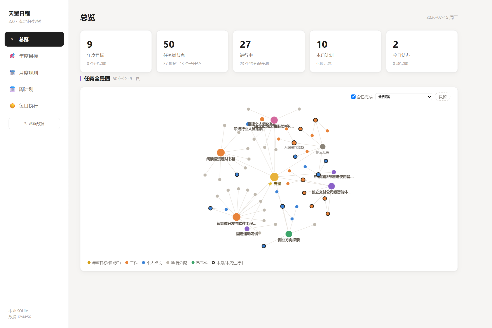
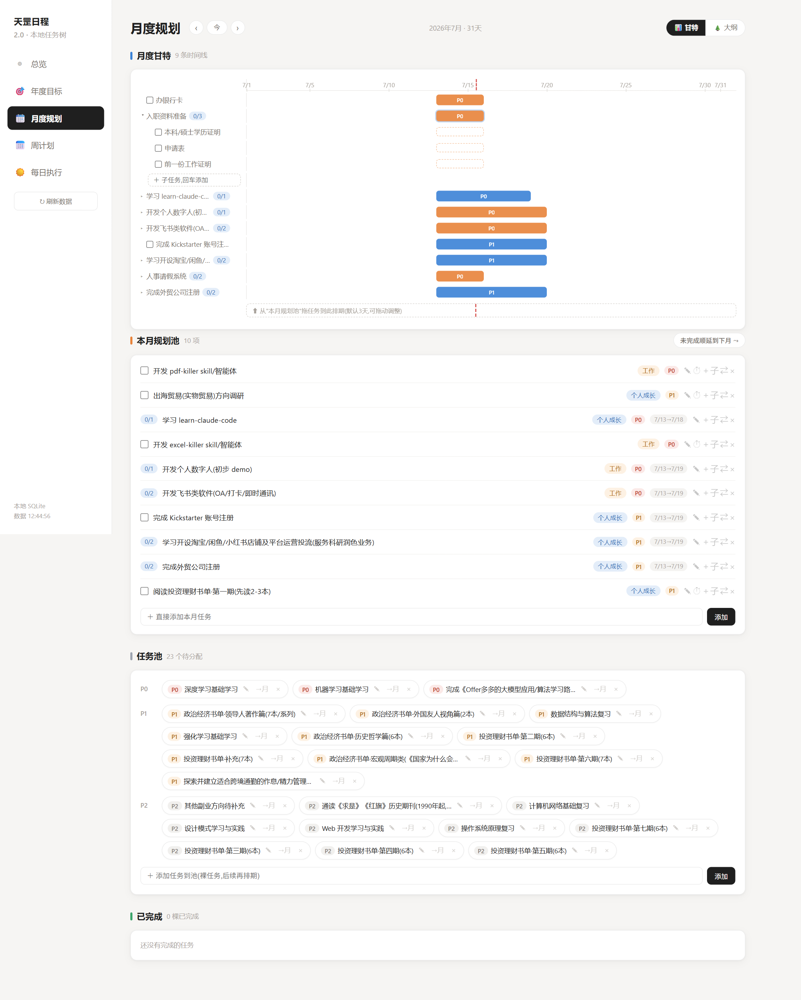
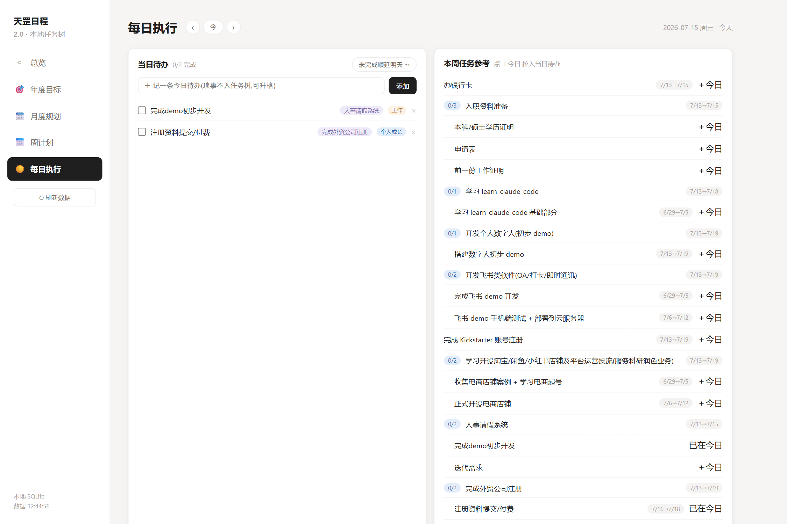
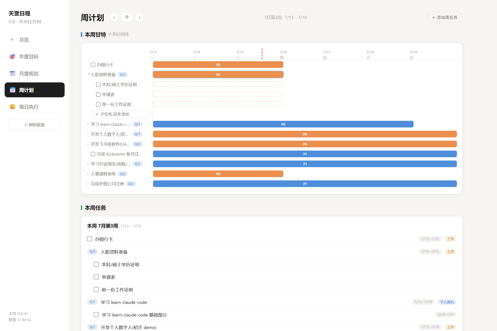
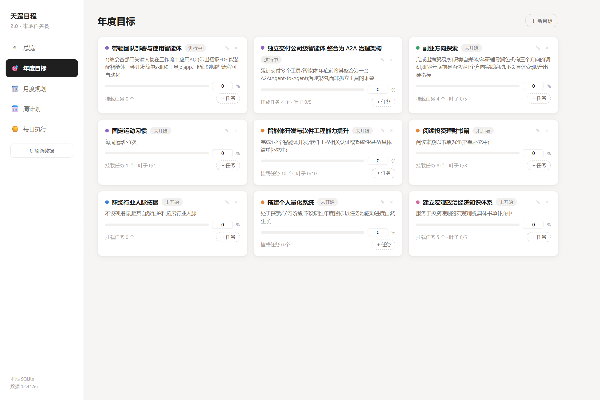

# 天罡日程 2.0 · tiangang-planner

> 本地优先的**任务树**规划系统：一棵树管到底,从年度目标到今天要干嘛。
> SQLite 单文件存储 · 零构建 · 零重型依赖(仅 express + dotenv) · 单文件前端

前身是基于 Notion 的 [notion-life-dashboard](https://github.com/icarus0926/notion-life-dashboard),2.0 与 Notion 干净分手:数据完全落在本地 SQLite,毫秒级读写,不再受 API 限速与网络束缚。

## 这个项目能干什么

把「年 → 月 → 周 → 日」的规划打通成**一棵递归任务树**:

- **任务即树**:任何任务都可以无限拆子任务;子任务与任务同权(一样可以排期、拖拽、再拆分)
- **根可生于任意尺度**:年度目标下挂任务、任务池丢裸想法、月度直建、周内直排、今日琐事一键**升格 ↗**为正式任务
- **完成自动冒泡**:叶子任务手动勾选;父任务在全部子任务完成时自动完成,重开任一子任务父级自动重开(双向、可逆)
- **字段点亮可见性**:挂目标→年度页可见;填月份→进月度规划池;填起止日期→上甘特图;拉入某天→当日待办。同一条数据,四个时间尺度各取所需
- **挂靠 ⇄ 与独立 ⇱**:任务可随时挂到别的任务下面/独立成顶层,挂靠只改层级不动排期,且有成环防护
- **顺延不污染历史**:月度/每日一键顺延未完成项;`month` 记计划归属、`done_at` 记完成历史,统计不受顺延影响
- **每笔写操作留审计**,启动时+每 24h 自动备份,滚动保留 30 份

## 页面演示

### 总览 · 任务全景图



四层统计 KPI + **自绘力导向任务图谱**(canvas,零依赖):年度目标是簇心(按领域配色),顶层任务环绕,子任务向外辐射;节点大小=子树规模,深色描边=本月/本周进行中,绿色=已完成。滚轮缩放、拖拽平移、节点拖动后钉住、hover 看档案、**点击任意节点直接跳到对应页面并展开高亮**;可过滤已完成、聚焦单个目标簇。

### 月度规划(甘特 / 大纲双视图)



- **月度甘特**:树形时间线,▸ 逐层下钻。实线条=已排期(拖动改期、两端手柄改时长,**父条拖动=整棵子树平移**);虚线幽灵条=未排期子任务(点击按父范围落定);虚线信封条=没排期但子孙有日期的父任务(自动包络)。左侧标签上下拖动排同层顺序(排序≠挂靠,跨层拖动会被拦下),× 一键退回规划池
- **本月规划池**:本月要做的事,含单独排进本月的子任务(带面包屑徽章);✎ 就地改名、优先级点击轮换、⏱ 一键排期、＋子任务、⇄ 挂到、未完成顺延下月
- **任务池**:还没分配的裸想法,按 P0/P1/P2 分层;「→月」排入当月
- **已完成**:整树完成的任务归档区,↩ 一键恢复(整棵重开)



顶部 **[📊 甘特 | 🌲 大纲]** 一键切换;大纲=不限层深的全树缩进视图,与甘特共享展开状态和全部操作。

### 周计划



同一棵树的 7 天窗口(周层级零存储,纯按日期现算):周甘特带星期刻度,树形下钻与月甘特同引擎;「＋添加周任务」直接以本周为出生日期生根;下方本周任务卡树形展示、已完成自动分区。

### 每日执行


- **当日待办**:自由文本随手记(琐事默认不进任务树),右侧 ↗ 一键升格为正式任务;勾掉关联叶子任务的待办,任务树同步完成并向上冒泡;未完成一键顺延明天
- **本周任务参考**:本周的树,「＋今日」把叶子拉进当日待办(同任务同日自动查重)

### 年度目标



目标卡增删改、手填进度条、挂载任务数与叶子完成比;「＋任务」直接在目标下生根(先进池,后续再排期)。

## 快速部署

**依赖:Node.js ≥ 22.5**(使用内置 `node:sqlite`,无任何原生编译依赖,Windows/macOS/Linux 通用)

```bash
git clone https://github.com/icarus0926/tiangang-planner.git
cd tiangang-planner
npm install                 # 只有 express + dotenv 两个依赖
cp .env.example .env        # 编辑 DASH_PASSWORD(访问口令)与 PORT
npm start                   # → http://localhost:8790
```

Windows 用户可直接双击 `start.bat`(自动开浏览器,重复双击不会起第二个服务)。

首次启动自动建库(`data/tiangang.db`),空库即可用;自动备份写入 `backups/`。

### 给 AI Agent 的部署摘要

```yaml
runtime: node >= 22.5 (built-in node:sqlite, no native deps)
install: npm install
config: copy .env.example to .env; set DASH_PASSWORD (any string), PORT (default 8790)
run: npm start          # or: node server.js
verify: GET /api/data with header "x-dash-key: <DASH_PASSWORD>" returns {goals,tasks,executions}
test: npm test          # 33 integration tests, in-memory temp DB, no side effects
data: single file data/tiangang.db (auto-created; WAL mode; auto-backup to backups/)
```

## 架构

```
tiangang/
├── server.js            Express REST API·完成冒泡·挂靠成环防护·顺延事务·审计·自动备份
├── db.js                node:sqlite 封装(WAL/外键/幂等建表/事务/滚动备份)
├── public/index.html    单文件前端(四页+甘特/大纲/力导向图,零框架零构建)
├── migrate/             (可选)Notion 旧数据一次性迁移脚本
├── data/tiangang.db     数据(gitignore)
└── backups/             自动备份(gitignore,保留30份)
```

**数据模型**(4 张表):`goals` 年度目标 / `tasks` 递归任务树(`parent_id` 自引用,`status` pool→planned→done→archived) / `executions` 每日执行(自由文本 XOR 任务关联,`UNIQUE(task_id,date)`) / `audit` 全量写审计。

**核心语义**:完成冒泡在服务端一处实现;进度=子树叶子完成比,接口计算返回;删除=整树软归档,硬删仅限已归档;挂靠(re-parent)带成环检测。

## API 一览

```
GET    /api/data                     全量数据(任务附 leaves/done_leaves 进度)
POST   /api/task                     建任务(生根尺度由出生字段决定)
PATCH  /api/task/:id                 改任意字段(parent_id=挂靠/独立,自动重估新旧父链)
POST   /api/task/:id/toggle-done     叶子勾选(服务端向上冒泡)
DELETE /api/task/:id                 软归档整树;?hard=1 硬删(仅已归档)
POST   /api/task/:id/restore         恢复(整树重开)
POST   /api/rollover                 {scope:'month'|'day',from,to} 事务顺延未完成
POST   /api/execution                当日待办({task_id}|{text})
PATCH  /api/execution/:id            勾选(叶子任务联动完成)
POST   /api/execution/:id/promote    自由文本升格为任务
DELETE /api/execution/:id
```

所有 `/api/*` 需请求头 `x-dash-key: <DASH_PASSWORD>`。

## 从 Notion 迁移(可选)

`migrate/1-notion-snapshot.mjs` 全量拉取旧 Notion 库存成 `snapshot.json` 永久留档;`migrate/2-import.mjs` 将快照导入 SQLite(池+月度按关联合并、步骤块→子任务、每日待办→执行记录,附对账输出;已有库时需 `--force` 防误覆盖)。不用 Notion 的直接跳过,空库开箱即用。

## License

[MIT](LICENSE)
